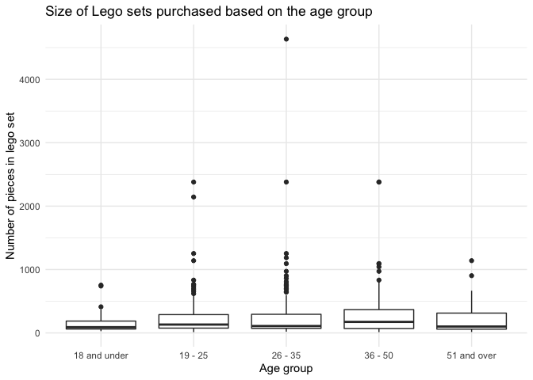

HW 06 - Legos
================
Raya Shelashska,
July 19, 2022

## Load packages and data

``` r
library(tidyverse)
library(dsbox)
```

## Exercises

### Exercise 1

Three the most common names of purchasers are Jackson, Jacob, and
Joseph.

``` r
lego_sales %>%
  count(first_name, sort = TRUE) %>%
  top_n(3)
```

    ## Selecting by n

    ## # A tibble: 3 × 2
    ##   first_name     n
    ##   <chr>      <int>
    ## 1 Jackson       13
    ## 2 Jacob         11
    ## 3 Joseph        11

### Exercise 2

Three the most common themes of Lego sets: Star Wars, Nexo Knights, and
Gear.

``` r
lego_sales %>%
  count(theme, sort = TRUE) %>%
  top_n(3)
```

    ## Selecting by n

    ## # A tibble: 4 × 2
    ##   theme            n
    ##   <chr>        <int>
    ## 1 Star Wars       75
    ## 2 Nexo Knights    64
    ## 3 Gear            55
    ## 4 Mixels          55

### Exercise 3

``` r
lego_sales %>%
  filter(theme == "Star Wars") %>%
  count(subtheme, sort = TRUE) %>%
  top_n(3)
```

    ## Selecting by n

    ## # A tibble: 4 × 2
    ##   subtheme              n
    ##   <chr>             <int>
    ## 1 The Force Awakens    15
    ## 2 Buildable Figures    11
    ## 3 Episode V            10
    ## 4 MicroFighters        10

``` r
# is there is a way to make it one chunk? I tried to add more themes in the filter line but it didn't work
```

``` r
lego_sales %>%
  filter(theme == "SNexo Knights") %>%
  count(subtheme, sort = TRUE) %>%
  top_n(3)
```

    ## Selecting by n

    ## # A tibble: 0 × 2
    ## # … with 2 variables: subtheme <chr>, n <int>

``` r
lego_sales %>%
  filter(theme == "Gear") %>%
  count(subtheme, sort = TRUE) %>%
  top_n(3)
```

    ## Selecting by n

    ## # A tibble: 4 × 2
    ##   subtheme                     n
    ##   <chr>                    <int>
    ## 1 Role-Play toys               7
    ## 2 Stationery                   7
    ## 3 Key Chains/Friends           6
    ## 4 Key Chains/Miscellaneous     6

### Exercise 4

``` r
lego_sales <- lego_sales %>%
  mutate(age_group = case_when(
    age <= 18 ~ "18 and under",
    age > 18 & age <= 25 ~ "19 - 25",
    age > 25 & age <= 35 ~ "26 - 35",
    age > 35 & age <= 50 ~ "36 - 50", 
    age > 50 ~ "51 and over"
    ))
```

### Exercise 5

36-50 years-old-group made the most purchases

``` r
lego_sales %>%
  group_by(age_group) %>%
  summarise(total_n = sum(quantity)) %>%
  arrange(desc(total_n))
```

    ## # A tibble: 5 × 2
    ##   age_group    total_n
    ##   <chr>          <dbl>
    ## 1 36 - 50          313
    ## 2 26 - 35          267
    ## 3 19 - 25          174
    ## 4 51 and over       92
    ## 5 18 and under      45

### Exercise 6

36-50-years-old group spent the most money - $6642

``` r
lego_sales %>%
  group_by(age_group) %>%
  summarise(total_n = sum(us_price)) %>%
  arrange(desc(total_n))
```

    ## # A tibble: 5 × 2
    ##   age_group    total_n
    ##   <chr>          <dbl>
    ## 1 36 - 50        6642.
    ## 2 26 - 35        5260.
    ## 3 19 - 25        3630.
    ## 4 51 and over    1832.
    ## 5 18 and under    642.

### Exercise 7

Star Wars made the most profit for Lego

``` r
lego_sales %>%
  group_by(theme) %>%
  summarise(total_n = sum(us_price)) %>%
  arrange(desc(total_n))
```

    ## # A tibble: 25 × 2
    ##    theme           total_n
    ##    <chr>             <dbl>
    ##  1 Star Wars         2842.
    ##  2 Ninjago           1650.
    ##  3 Nexo Knights      1569.
    ##  4 City              1477.
    ##  5 Minecraft         1440.
    ##  6 Gear              1056.
    ##  7 Friends            925.
    ##  8 Duplo              855.
    ##  9 Elves              810.
    ## 10 Advanced Models    680.
    ## # … with 15 more rows

### Exercise 8

``` r
#I can't figure it out.
```

### Exercise 9

``` r
ggplot(data = lego_sales, aes(x = age_group, y =  us_price)) +
  geom_boxplot()
```

<!-- -->
